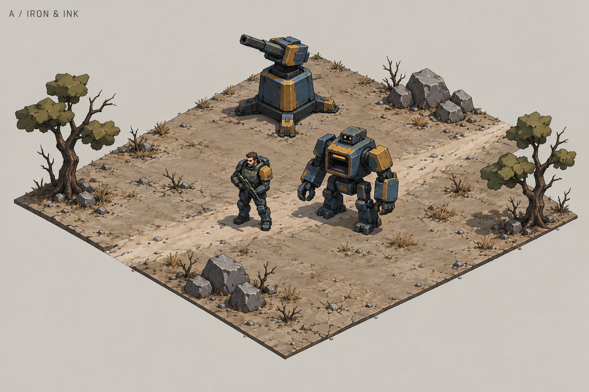
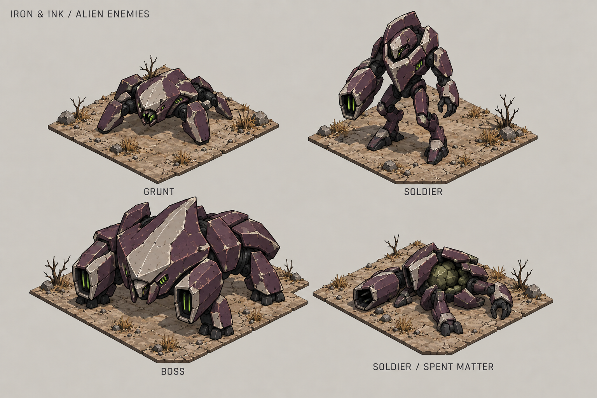
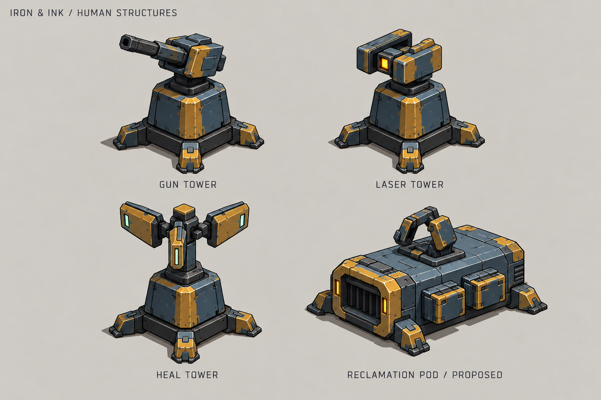
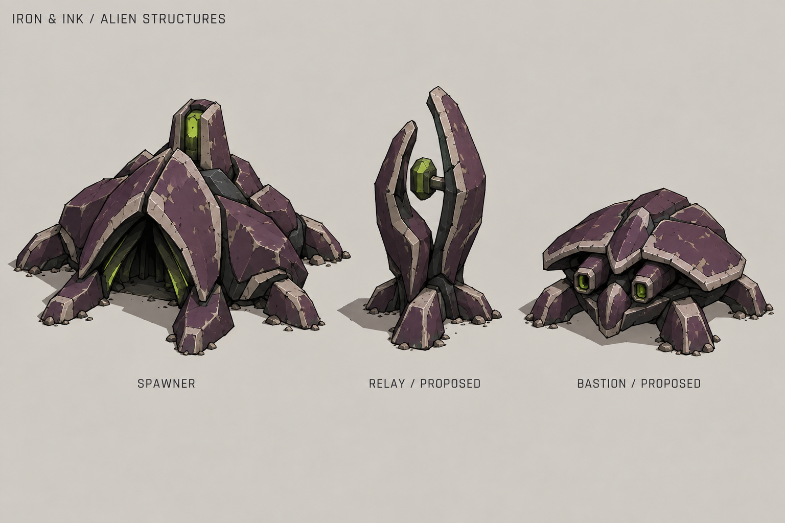
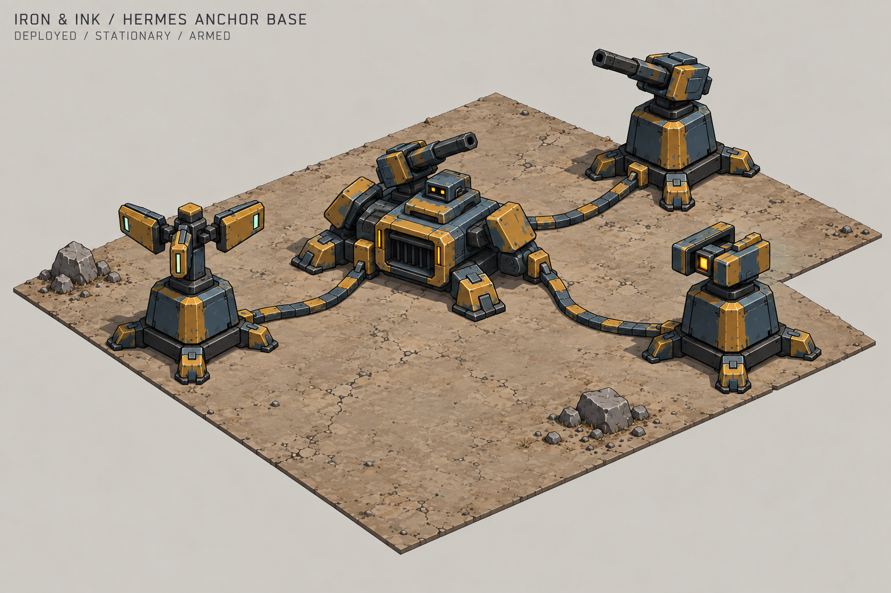
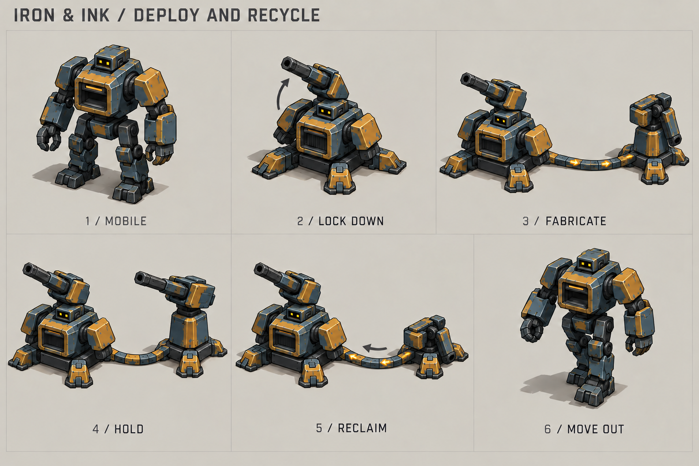
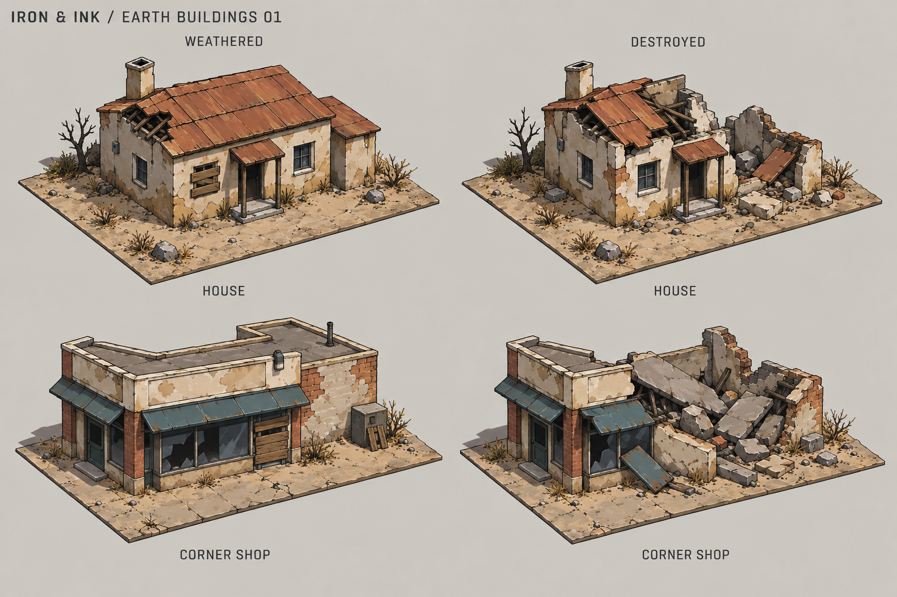
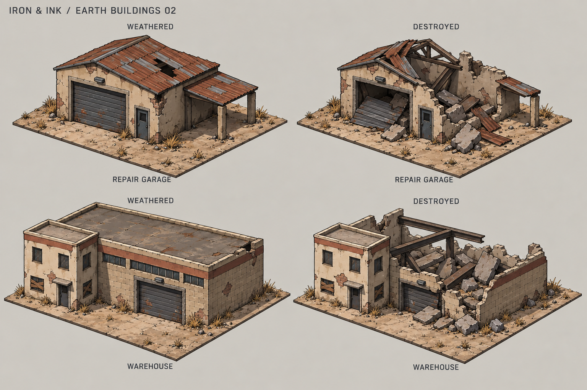
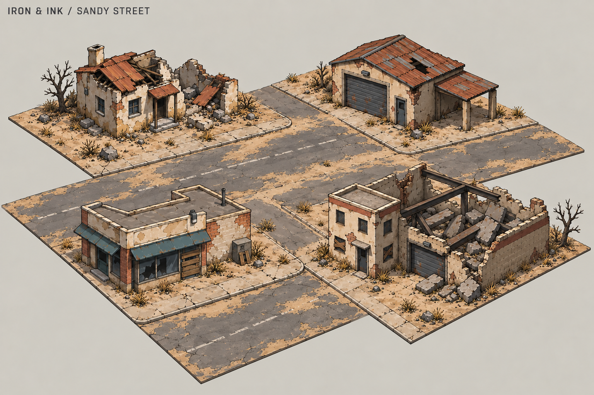

# Nathaniel concept art

Selected direction: **A / Iron & Ink**. These images explore the look of the
game before production modelling. They are concept references, not sprite
sheets, Blender models, or implemented gameplay changes.

## Examples

| Image | Contents |
| --- | --- |
| [Original scene](iron-and-ink/01-scene.png) | Nathaniel, Hermes, gun tower, path, rocks, and trees. This is the selected style reference. |
| [Alien enemies](iron-and-ink/02-alien-enemies.png) | Grunt, soldier, boss, and a spent soldier body for the matter loop. |
| [Human structures](iron-and-ink/03-human-structures.png) | Gun, laser, and healing towers, plus a proposed reclamation pod. |
| [Alien structures](iron-and-ink/04-alien-structures.png) | Spawner, plus proposed relay and bastion designs. |
| [Hermes anchor base](iron-and-ink/05-hermes-anchor-base.png) | Hermes deployed as a stationary armed hub, physically connected to three towers. |
| [Deploy and recycle](iron-and-ink/06-hermes-deploy-recycle.png) | Six stages from mobile Hermes through construction, defense, and complete reclamation. |
| [Earth homes and shops](iron-and-ink/07-earth-homes-shops.png) | Weathered and destroyed versions of an ordinary house and corner shop. |
| [Earth garages and warehouses](iron-and-ink/08-earth-garages-warehouses.png) | Weathered and destroyed versions of a repair garage and warehouse. |
| [Sandy street](iron-and-ink/09-sandy-street.png) | The four civilian buildings together, with standing and ruined structures around open streets. |

[Hermes build-mode notes](hermes-build-mode.md) describe the transformation,
connections, and teardown sequence. In this proposal, Hermes himself is the
fabrication hub; the earlier separate reclamation pod is not needed.

## Sandy Earth buildings

This area uses ordinary Earth architecture: plaster and brick walls, simple
pitched or flat roofs, shop awnings, roller doors, and concrete paving. The
buildings are abandoned and disheveled, with sun-bleached cream walls, faded
terracotta or rust roofs, charcoal openings, and small faded teal accents.
Sand gathers at foundations and across cracked asphalt. This palette applies
to the sandy area; other areas can have their own materials and colors.

Each building has a weathered standing version and a matching destroyed
version. Preserve its footprint, ground anchor, camera, and key features
between states. The house keeps its porch and chimney; the shop keeps part
of its awning and storefront; the garage keeps its vehicle-door frame; the
warehouse keeps its taller office facade. The sheets are visual references,
not pixel-aligned production pairs or measured scale drawings.

Make destruction read through missing roof and wall masses. Use a few large
slabs and thick beams rather than many small fragments. In Blender, build a
shared wall and roof kit, then create a separate damaged version from those
parts. No fracture simulation is needed for these static appearance studies.

The street scene combines standing and ruined buildings while keeping the
main route clear. It demonstrates appearance and spacing, not tested movement
or collision. The amount of small brick, roof, and ground detail should be
reduced for production sprites. Destructible-building gameplay is not specified
by these concepts.

## Visual rules

- Use bold outer contours, large angular forms, and two or three values per
  material. Keep wear broad and sparse.
- Use petrol blue, ochre panels, and dark joints for human equipment. Repeat
  Hermes's intake shape and the towers' folding feet across temporary bases.
- Use dark plum shell plates, pale edges, and small acid-green openings for
  aliens. Keep each role clear through shape, not color alone.
- Keep the grunt low and wide, the soldier upright, and the boss broad with
  one large crest. Keep the spawner's emergence opening clear.
- Reuse one tower base. Distinguish the gun barrel, split laser emitter, and
  open healing mast by their outlines.
- Keep ground detail quieter than units. The original scene and enemy sheet
  have more ground texture and surface wear than production sprites need.

## Scope

The grunt, soldier, boss, spawner, gun tower, laser tower, and healing tower
match existing gameplay kinds. Their depicted appearance is exploratory.
Only soldiers currently leave usable bodies, so the matter example uses a
soldier. The reclamation pod, relay, and bastion are visual proposals; their
gameplay roles and inclusion remain undecided.

The aliens in this pass have a hard, partly mechanical shell. Their mix of
organic tissue and machinery remains open for refinement.

## Production constraints

Use the [Blender sprite pipeline](../docs/blender-assets.md): orthographic
camera, 45-degree azimuth, 30-degree elevation, and a 64 by 32 pixel ground
diamond. The current prop pipeline uses a 128 by 128 pixel transparent canvas
with ground anchor at (64, 96). These generated concepts approximate that
view; they are not calibrated renders or scale drawings.

Build the main forms from bevelled boxes, wedges, cylinders, and low-poly
shells. Use shared materials and repeated parts. Avoid modelling the small
scratches, seams, and joints visible in the concept images.

Check production designs at their actual display sizes before adding detail:
Nathaniel 48 by 72 pixels, Hermes 80 by 72, grunt 72 by 33, soldier 60 by 72,
boss 80 by 72, towers 48 by 66, and spawner 240 by 168. The sheets have not
been tested in game or across animation directions.

## Source and reuse

Created with the Codex built-in imagegen tool on 2026-10-03. The original
scene established direction A; later sheets use that scene and related
concept sheets as references. [prompts.json](prompts.json) stores the exact
prompts, refinement steps, and reference relationships for further iteration.
Image generation is not deterministic.

The local `.gdignore` keeps these reference images out of Godot's asset
import. Production sources belong under `art/blender/`; these sheets remain
concept references.
