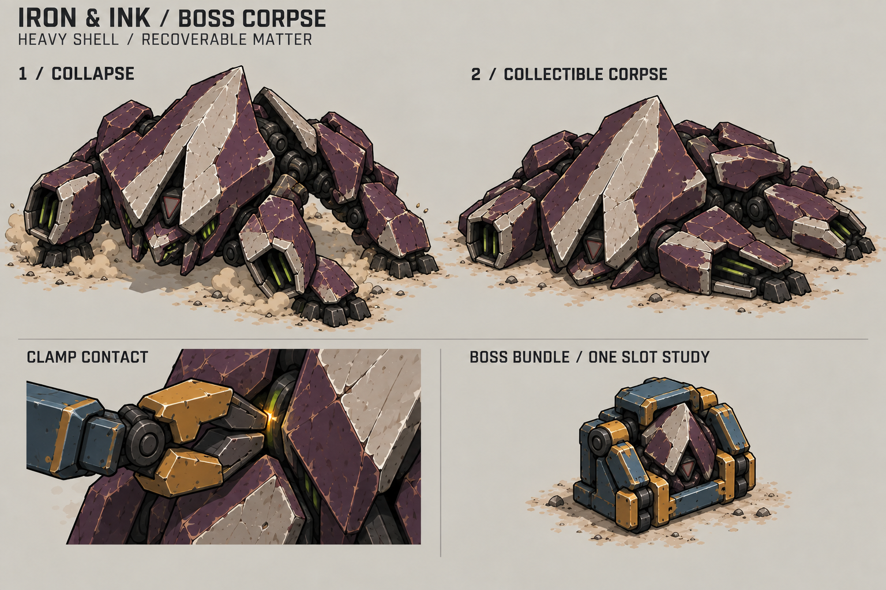
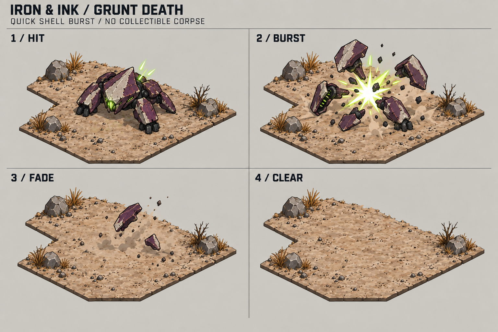
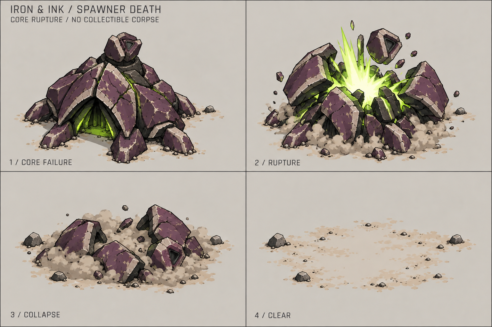

# Enemy deaths: boss matter and shell explosions

Requested on 2026-10-04. The boss should leave a collectible corpse. Grunts
and spawners should explode on death. These sheets define appearance and
propose handling rules; they do not implement those changes.

| Enemy | Requested death result | Resource outcome |
| --- | --- | --- |
| Soldier | Keep the existing corpse and collection sequence. | Collect, disarm, crush, and feed Hermes. |
| Boss | Collapse into a distinct heavy corpse. | New collectible boss matter; value remains undecided. |
| Grunt | A small, sharp shell burst, then clear ground. | No collectible corpse or fragments. |
| Spawner | A larger core rupture and falling crown, then clear ground. | No collectible corpse or fragments. |

The internal `gunSoldier` variant keeps the existing soldier resource behavior.
This pass does not add another enemy type.

## Boss: a collapsed heavy shell

Survival is the direct use case: the boss dies, the run continues, and
Nathaniel can collect its matter, feed Hermes, and spend the resources during
that same run. Boss corpse support should work there without changing victory
flow or carrying resources between levels. The resource value remains open.

The boss must look dead while keeping its broad crest, four heavy legs, and
recessed triangular laser aperture. Buckle the legs outward, lower the belly
to the ground, and tilt the crest diagonally across the body. The aperture
goes dark immediately. Keep the major plates attached so the remains read
as one recoverable body. A short ground-level dust puff marks the collapse.

The corpse has a low, wide silhouette, roughly half the living height. Avoid
a standing idle pose, an upright soldier body, or a generic pile of rocks.
Its broad pale crest stripe should identify it at normal game zoom. The
neutral view on the sheet has dim seams; it is not the bright warning phase.

Use the existing collection sequence as the proposed baseline. The armed
corpse has ten seconds from death, including the collapse, with warning
flashes during the final three seconds. It dissolves if not secured. A
successful backpack grip permanently disarms it before crushing. The collapse
is presentation only and must not create a second timer or prevent an otherwise
valid collection. Clear the collapse image when the arms take ownership.

The bundle study proposes **one boss body becoming one cargo bundle in one
slot**, collectable with the starter tool. Keep a pale crest shard and small
dark prism face in the compressed form. Compression is a visual abstraction;
check the size change, clamp reach, and Hermes's intake in a blockout. This
proposal adds no special lifting upgrade or multi-part harvesting process.
The boss's resource value is not set by this sheet. Disarm and pickup do not
credit resources; Hermes's accepted transfer does.

### Campaign completion is a separate case

Currently, boss death ends a campaign level immediately and stops simulation.
Continue creates a new simulation with the next level's starting resources;
neither cargo nor the current wallet carries over. A corpse alone would thus
give the player neither time to collect it nor a useful campaign reward.

Before enabling recovery from a campaign boss that ends the level, define an
optional collection and delivery opportunity after the fight, and what the
recovered matter grants across completion.
That could require a change to victory flow and reward persistence. These
concepts do not choose a carry-over amount, add a currency, or change saves.
These campaign decisions do not block the survival corpse design or its
implementation.

## Grunt: a quick shell burst

Keep this small enough for several nearby grunt deaths. A brief lime-white
flash breaks the low shell into four or five broad plum pieces. Throw them
only a short distance, extinguish the light, and fade the fragments with a
small dust puff. End on clear ground with no body or collectible debris.

Start with about 0.4 seconds for the full effect. Use a sharp onset and fast
falloff, not a long warning or the corpse's gradual dissolve. The flash should
stay close to the former body footprint. An optional short shell crack can
support the visual without a heavy explosion tail.

## Spawner: core rupture and crown collapse

Stop the crown laser and spawning when death is accepted. Light briefly rises
inside the emergence arch and the major shell joins. The dome splits into a
few large wedges around a contained lime-white burst. The unlit crown falls
sideways as one recognizable piece. A low dust puff hides the final shell
pieces as they fade, leaving the footprint empty.

Start with about 0.8 seconds for the full effect. Its larger body, displaced
crown, and deeper optional crack distinguish it from the grunt. Keep dust
below the old crown height so it does not hide nearby units. Transient shell
pieces are effects, not a permanent wreck, obstacle, or resource deposit.

## Shared production and behavior

Treat both explosions as visual feedback by default. They add no blast damage,
knockback, chain reactions, loot, or persistent blocking. The living actor is
dead immediately; a short effect can remain after its view is removed. Never
keep its weapon or spawner logic active merely to finish an animation.

Preserve the Iron & Ink palette and fixed isometric view. Green-white light
comes from the alien core; plum fragments connect the effect to the original
body. Keep the backdrop quiet, outlines broad, and particles few. Avoid large
fireballs, screen flashes, camera shake, gore, and detailed fracture simulation.

Build the boss corpse by posing the saved boss parts. Make one compressed
bundle mesh and reuse the existing clamp contact and dissolve treatment.
For explosions, animate a few reusable rigid shell pieces with a short flash
and dust sequence, or render them into a small sprite sequence. Keep the same
ground anchor between intact, burst, fade, and clear states. The sheets
approximate the camera and are not pixel-aligned production frames.

Check the boss corpse against the live boss silhouette, collection reach,
backpack slot, and both Hermes intake heights. Check both explosions with
several simultaneous deaths at normal zoom, on sand and dark rubble. Their
effects must finish once, stop advancing during pause, and leave no ghost
actor, collectible fragment, or repeated death event. These checks are for
future implementation; the concept sheets are not gameplay tests.

## Current implementation boundary

Fresh source check on 2026-10-04: only `soldier` and `gunSoldier` leave
collectible bodies. Their warning, dissolve, and permanent disarm behavior
are implemented. Boss, grunt, and spawner deaths create no resource body.
The existing general death feedback is an explosion sound and a short orange
ring, with the actor view removed immediately.

See [death handling](../scripts/domain/game_simulation.gd),
[resource rules](../scripts/domain/battlefield_rules.gd),
[effects](../scripts/presentation/world_effects.gd),
[level transitions](../scripts/presentation/game_app.gd), and
[resource gathering](../docs/resource-gathering.md). Boss corpse support also
needs corpse-kind validation, save compatibility, and artwork support; an
extra image alone cannot enable collection.

Created with the built-in imagegen tool. Exact prompts and reference images
are recorded in [prompts.json](prompts.json).
