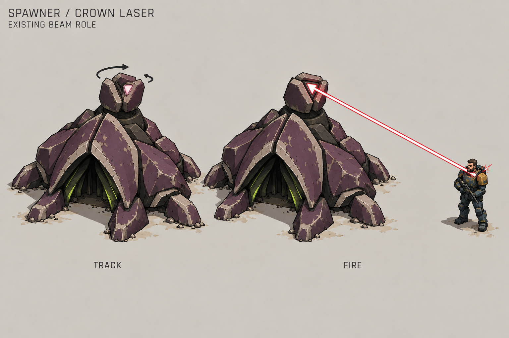
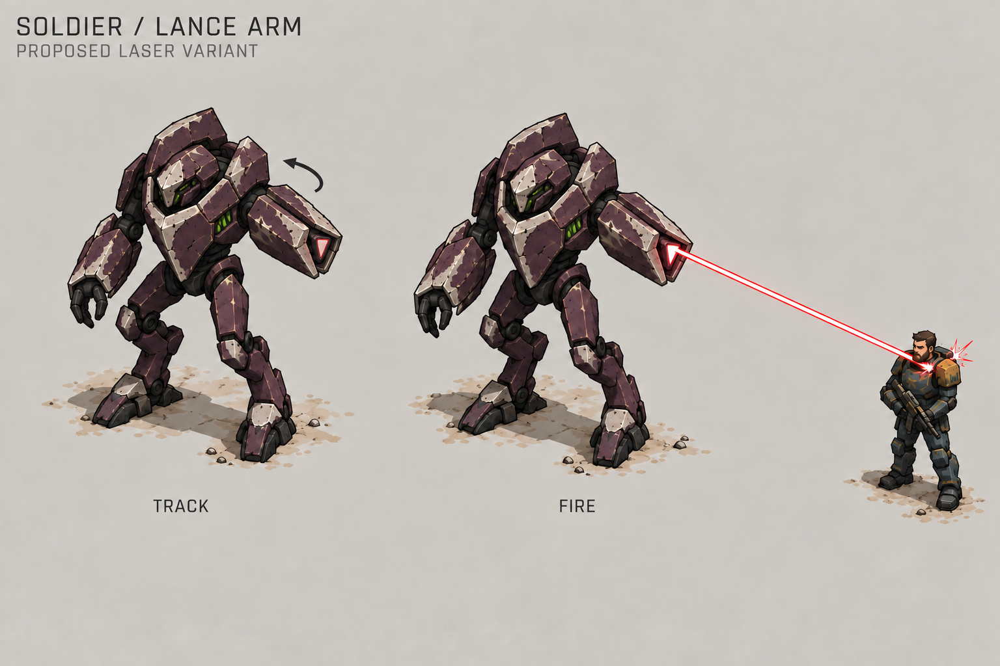
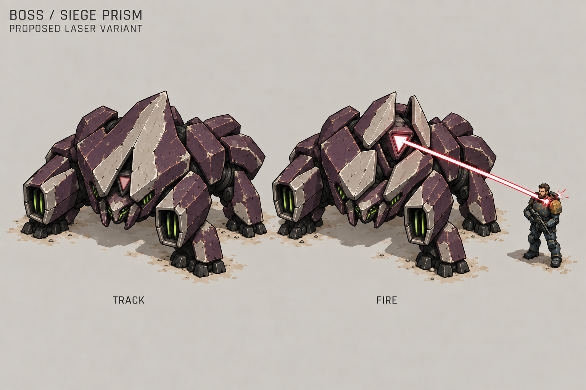

# Enemy laser concepts

The spawner is the current enemy beam user. Its beam needs a visible source
that can aim while the main body stays rooted. These sheets explore the
appearance of the weapon and its effects; they do not change gameplay.

The user also requested proposed laser-equipped soldier and boss variants.
Those concepts are explicitly marked as proposals on their sheets. They do
not select replacements for the existing projectile weapons.

| Concept | Status | Main visual change |
| --- | --- | --- |
| Spawner crown laser | Refines an existing beam role | A separate crown aims above the emergence opening. |
| Soldier lance arm | Proposed laser variant | An integrated forearm lens gives a clear pointing pose. |
| Boss siege prism | Proposed laser variant | A split crest opens around a protected central emitter. |

## Spawner: crown laser

Keep the large triangular emergence opening, low shell body, and four broad
supports. Put a compact triangular lens inside three thick shell plates at
the top of the rear spire. This crown turns and tilts independently. The
beam leaves that lens and clears the shell, while the emergence opening
stays dark and unobstructed.

The change makes aiming visible without rotating the whole building. It also
separates the weapon from the opening that produces enemies. The crown needs
only a turntable and tilt joint; the body can keep its existing simple form.

## Soldier: lance arm

Preserve the tall narrow body, high collar, reverse knees, and one small claw.
The other forearm ends in three large shell plates around a triangular lens.
The integrated arm points at the target, keeping a clear gap beside the body.
Its precision beam starts at the wrist aperture, not the head or chest.

Use one physical weapon arm consistently through every facing and animation.
The other claw remains free. Keep the shell openings and elbow motion simple
enough to animate with rigid parts. This is the more direct mobile variant
to develop because the existing soldier already has a large weapon forearm.

## Boss: siege prism

Keep the broad four-legged stance and large pale crest. Split that crest into
a few heavy shutters that reveal a triangular optical core above the face.
The shutters and exposed lens make the firing state clear. The side lobes
remain protective armor and dim vents rather than additional beam sources.

Show one slightly broader ray than the soldier's, with a contained impact.
The heavy outline and opening crest communicate the threat. The image does
not define extra damage, a charge delay, a sweeping attack, or an area effect.
Build the emitter and crest from a few pivoting pieces; do not rely on shell
deformation or a cloud of particles.

## Beam and contact

Use a narrow, connected beam with a pale pink-white core and tight crimson
edge. This develops the existing pink-red enemy beam and keeps it distinct
from Hermes's amber laser. Acid-green vents remain part of the alien shell;
the active weapon lens brightens toward pink-white.

Show a small contact star and a few short sparks where the beam hits armor.
Keep lens light and impact local. Preserve clear unit silhouettes without
large glow clouds, smoke, or projectile trails. The beam must visibly start
at the lens and end at the target's surface.

## Current implementation boundary

Checked on 2026-10-04: `spawner_laser` is the only enemy beam profile. Grunts
use `blaster`, soldiers use `gun`, and bosses use `bow`; those weapons fire
moving projectiles. See [game balance](../scripts/domain/game_balance.gd)
and [combat rules](../scripts/domain/combat_rules.gd) for current behavior.

The spawner currently uses a static sprite. Its beam in
[WorldEffects](../scripts/presentation/world_effects.gd) starts at an offset
from the entity position, without an authored emitter or visible aiming
part. Implementing this concept would need a separate aiming crown and a
projected lens origin. Preserve the existing beam timing, damage, spawn rules,
and stationary behavior when improving its presentation.

The soldier and boss variants would need a separate gameplay decision before
implementation because their current weapons are projectiles. Their editable
sources are `art/blender/sources/soldier.blend` and `boss.blend` in the same
directory. Keep the current projectile versions available unless a later task
explicitly selects a replacement.

The editable source is `art/blender/sources/spawner.blend`. Follow the
[Blender pipeline](../docs/blender-assets.md) and edit saved sources rather
than runtime exports. A concept sheet is not proof that the aiming assembly,
beam attachment, or sprite sorting works in the game.

## Readability and reuse

All three use the same triangular alien lens, plum shell, and pink-white beam
with a crimson edge. The mount distinguishes the role: crown, arm, or crest.
Keep the beam attached to the visible aperture during every pose. Let each
unit's main silhouette carry its identity when the laser is off.

These sheets compare designs rather than calibrated world sizes. Nathaniel
is a contact-effect reference, not a scale ruler. Preserve the intended game
scale when making assets. Simplify the fine shell cracks and wear at gameplay
size. Check both light sand and dark rubble, all aim directions, and moving
targets. Actual sprite readability and animation remain untested.

Created with the built-in imagegen tool on 2026-10-04. Exact prompts and the
soldier arm-consistency correction are recorded in [prompts.json](prompts.json).
