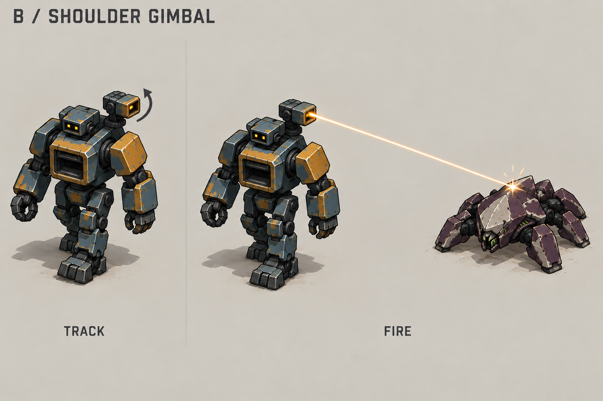

# Hermes shoulder laser: implementation brief

**Selected by the user on 2026-10-04: B, shoulder turret.** Use
[11-hermes-shoulder-laser.png](iron-and-ink/11-hermes-shoulder-laser.png) as the
visual target for implementation. This document defines the desired result;
it does not claim that the selected effect is implemented or verified.

Hermes uses this laser in his mobile/following form, including when he briefly
stands still. His deployed/building form uses the existing powerful cannon.
Select the weapon by mode, not by current movement speed. Preserve current
damage, range, firing cadence, target selection, movement, build rules, and
save compatibility. This task changes the weapon's appearance and aiming
presentation, not combat balance.

## Selected mount

A compact lens pod sits above one shoulder on a short pivoting bracket. It
turns and tilts separately from the head and walking body. Keep the pod short
and box-shaped, with one broad aperture. It should not look like the long
barrel of the deployed cannon.

Keep Hermes's two eyes, both clamp hands, and chest matter intake unchanged.
The pod stays on the same physical shoulder as he turns; match its placement
in the reference rather than moving it to screen-right in every facing. Keep
the mount clear of the head in every firing direction. Use a short bracket,
one turntable, and one tilt joint; reduce the pod if it reads as a second head.

The pod follows the combat target independently of the walking body. The
visible aperture, aim direction, and beam origin must agree throughout the
walk cycle. Use the mounted emitter's muzzle transform, including its height,
rather than the actor's ground point, face, chest, or a fixed screen offset.

## What the shot looks like

Implement the restrained effect shown in the selected sheet:

1. **Track:** the shoulder pod turns toward the target. No targeting beam
   is needed before the shot.
2. **Start:** the aperture briefly becomes a bright amber rectangle. Keep the
   flash inside or very close to the lens.
3. **Fire:** draw one narrow straight beam with a pale ivory core and amber
   edge. It connects the actual emitter to the visible contact point. Keep it
   thin enough that Hermes and the enemy remain easy to see.
4. **Contact:** show a small bright mark and two or three short sparks on the
   target's shell. A small dark mark can remain briefly. Stop the beam cleanly
   when the shot ends; avoid a trail that reads as a slow projectile.

While the existing combat state says the laser is firing, show a connected,
steady beam that tracks the target. Preserve the existing active interval and
damage timing; do not add a charge delay or change the laser into projectile
bursts. Contact sparks are a brief visual cue, not extra damage events. A
scorch mark is optional polish after beam attachment and aiming work.
Apply this palette and contact treatment to Hermes's mobile laser only; keep
other units' beam effects unchanged.

Clear the mobile beam when firing stops, its target is lost, Hermes dies, or
he enters deployed mode. In deployed mode, the cannon is the active weapon
and the shoulder laser is inactive. Keep the pod compactly stowed or inactive
without changing the established cannon, base connections, or recycling flow.

## Mobile laser versus deployed cannon

| Cue | Mobile laser | Deployed cannon |
| --- | --- | --- |
| Weapon shape | Small lens or short pod | Large barrel above the anchored body |
| Motion | Steady emitter, independent aim | Visible barrel recoil and return |
| Shot | Thin connected beam | Brief muzzle flash and a separate projectile |
| Contact | Small bright point and short sparks | One compact impact burst |
| Body | Walking silhouette remains visible | Wide, planted base |

Keep the difference clear through shape and motion, not just color. Avoid
large glow clouds, persistent smoke, and effects that hide nearby units.

## Implementation and acceptance

Start with these current integration points, checked on 2026-10-04:

- `scripts/presentation/actors/hermes_view.gd` uses sprite animation for the
  mobile body and a live model for the deployed cannon. Its `weapon_muzzle()`
  currently has no mobile muzzle. The new pod needs independent aim and an
  explicit emitter origin; changing the full-body sprite alone is insufficient.
- `scripts/presentation/world_effects.gd` currently draws lasers from projected
  entity positions raised by 20 pixels. Replace that approximation for Hermes
  with the shoulder emitter's projected origin.
- `art/blender/sources/hermes.blend` is the saved mobile source;
  `hermes_anchor.blend` in the same directory is the deployed source. Preserve
  the deployed cannon's live-model `Muzzle` path and current mode transition.
- Opening the Build UI alone does not deploy Hermes. Use the simulation's
  actual following/building state when switching weapon presentation.

Use the same Iron & Ink palette and orthographic 45-degree azimuth,
30-degree elevation. Keep the aiming assembly separate from the walking body.
Edit saved Blender sources and use the existing export workflow. Follow
[the pipeline](../docs/blender-assets.md), [weapons](../docs/nathaniel-weapons.md),
and [authoring](../docs/authoring.md). The
[domain guide](../scripts/domain/README.md) describes current combat behavior;
older concept text is not a gameplay specification.

The implementation is ready for review when these checks pass:

1. The pod reads as a compact shoulder weapon at normal gameplay zoom, with
   the face, hands, and intake still clear.
2. Hermes can walk and briefly stop in following mode while the pod aims
   independently. Check all eight body facings and targets around him.
3. The beam stays attached to the visible aperture and contacts the target
   while both units move. It does not cross Hermes's head or start at his feet.
4. The pale core, amber edge, and small contact flash remain visible on light
   sand and dark rubble without hiding units. Hermes has little or no recoil.
5. Deploy and follow transitions select the correct weapon with no stale
   laser. Target death or loss and Hermes's death clear the beam. Pause and
   resume preserve the game's existing animation behavior.
6. Current combat and base behavior remain unchanged. Run `rtk make format-check`,
   `rtk make test-hermes-base`, and relevant presentation, art, and gameplay
   checks for the files changed. Capture the result in the running game at
   normal zoom, including mobile laser fire and deployed cannon fire. Report
   which automated, visual, and real-input checks were completed.

## Retained alternatives

[A: face lens](iron-and-ink/10-hermes-face-laser.png) and
[C: forearm prism](iron-and-ink/12-hermes-forearm-laser.png) remain exploration
references. They are not implementation targets for this task.

The concept sheets were made with the built-in imagegen tool on 2026-10-04.
They are static references, not evidence of working animation or aim limits.
Exact generation prompts remain in [prompts.json](prompts.json).
