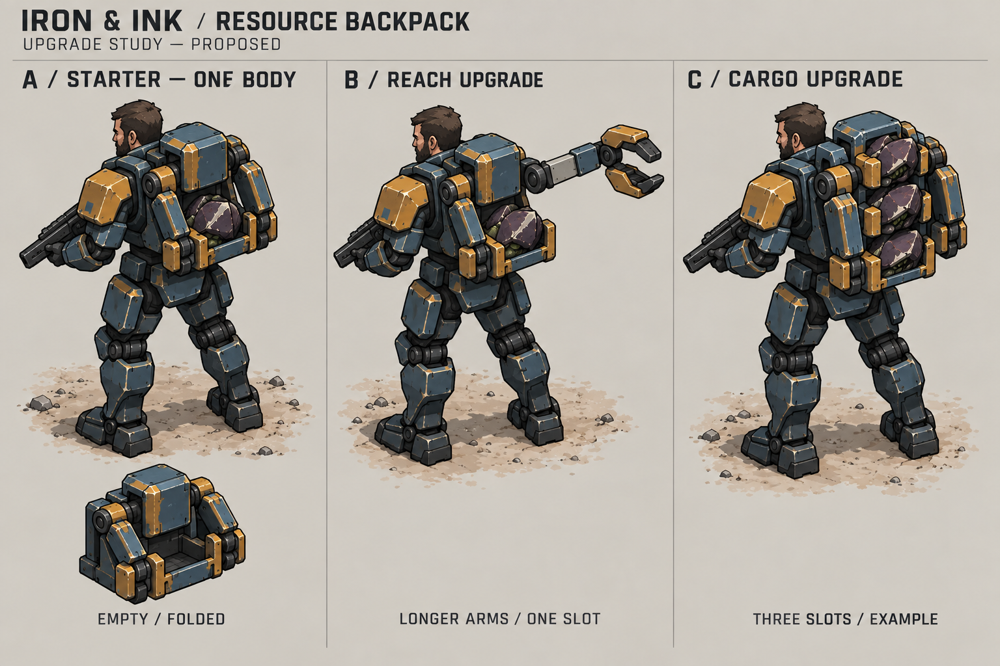
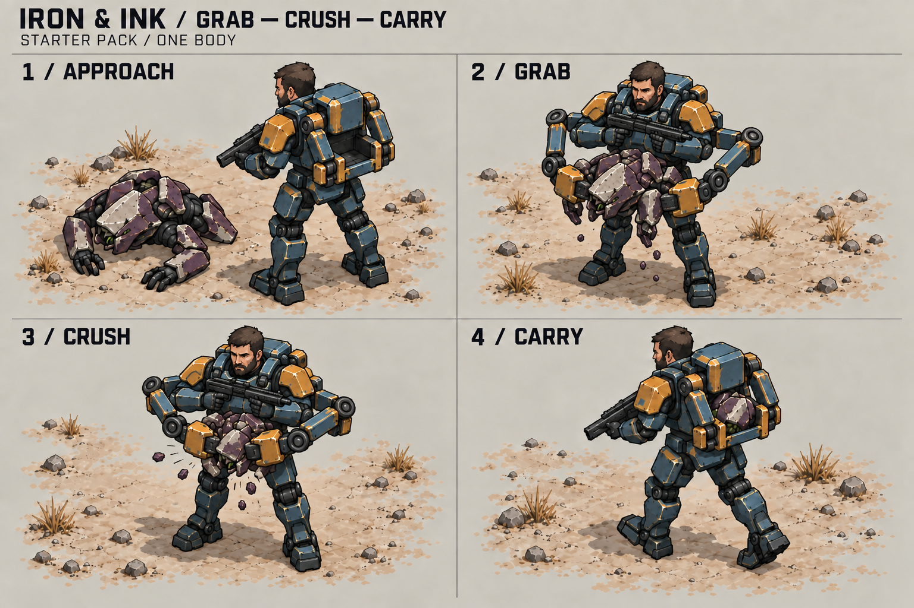
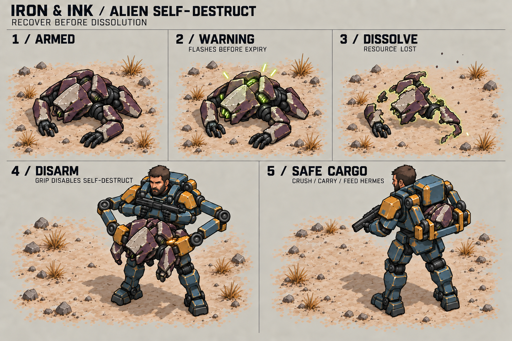
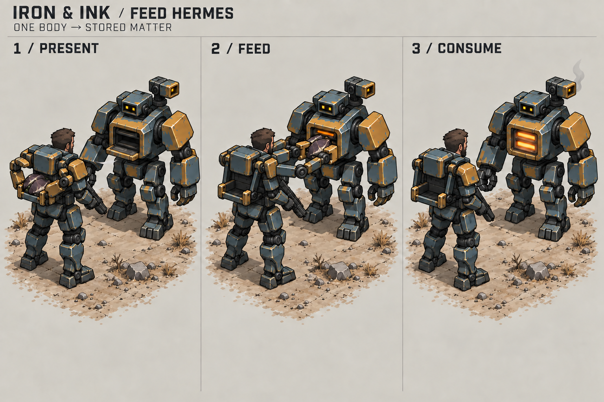

# Resource gathering: backpack and furnace

The implemented rules, provisional upgrade balance, and checks are documented
in [resource gathering](../docs/resource-gathering.md), including the
implemented corpse self-destruct sequence.

Nathaniel carries a small mechanical backpack with two folding grabber arms.
The arms take a nearby alien body, crush it into one compact bundle, and hold
it in an open rack. At Hermes, they place the bundle in his chest intake. The
intake closes and a short furnace pulse shows that Hermes has consumed it.

This is the concept direction requested on 2026-10-04. The sheets explore
appearance and motion. They do not implement collection rules, upgrades, or
animations.

## Backpack and upgrades

The starter holds **one body** and has **very short reach**. Use one rectangular
pack, two short mechanical arms, and one open cargo cradle behind the waist.
Each arm has a shoulder pivot, two rigid links, an elbow, and broad clamp jaws.
Both arms work together on one body; two arms do not mean two cargo slots.

The jaws also act as crushing pads. Fold the shell into a compact bundle with
a large plum plate and pale edge still visible. This keeps its origin clear.
The bundle is carried matter, not spendable resources. Its size is a visual
abstraction that needs a blockout check against the body and intake sizes.

Fold the arms close to the pack during movement. Hold the bundle in a visible
mechanical cradle. Keep Nathaniel's head, human arms, rifle, and feet clear.
The pack must attach to his armor through a rigid harness. Avoid loose hoses,
many small fingers, or thin arms that disappear at gameplay size.

The sheet separates two possible improvements:

- **Reach:** a short telescoping end link extends the same two arms. The
  single cargo slot remains unchanged in this example.
- **Capacity:** a taller rack adds visible cargo clamps. The three-slot
  version is an example, not an approved maximum or upgrade schedule.

Keep the rack below the head and within the armored shoulder width. Use the
same arm pair at every level. Further uses for the arms remain open; this
study adds no other tools or abilities. Upgrade costs, exact ranges, and
progression are not specified.

## Grab, crush, and carry

1. **Approach:** the body is beside Nathaniel's feet, within short reach.
   The pack is empty and its arms are folded.
2. **Grab:** both arms unfold around his sides and grip opposite sides of
   the shell. Keep a continuous visible connection from pack to jaws. The
   new self-destruct concept adds a clamp contact that disarms the body at
   successful grip, before crushing.
3. **Crush:** the jaws close inward. Large shell pieces fold together, with
   a small dust puff and a few chips. Avoid liquid spray or a large effect.
4. **Carry:** move the one bundle into the rear cradle, latch it, and fold
   the arms. Leave no duplicate body on the ground.

The empty cradle and occupied cradle provide the main capacity cue. At full
capacity, keep the load visible and the arms folded when another body is
nearby. Additional slots should fill individually after capacity upgrades.
Nathaniel keeps his weapon in his human hands; the backpack owns the handling
motion. The images do not decide whether pickup affects movement or firing.
The middle panels turn Nathaniel toward the viewer to expose both arms;
this is a presentation choice, not a required turn during collection.

For production, use a few rigid poses and replace the corpse mesh with an
intermediate compressed form, then the carried bundle while the jaws hide
the change. No soft-body or fracture simulation is needed. Preserve enough
shell detail to distinguish existing corpse types if required.

## Corpse self-destruct

Aliens destroy their remaining matter after death. This gives Nathaniel a
short recovery window and explains why his gathering tool is needed. The
upper row shows what happens to an unattended body. The lower row shows a
successful disarm and safe cargo; it is an alternative outcome, not a way to
recover a body after dissolution.

The full [implemented mechanics](../docs/resource-gathering.md#corpse-self-destruct)
define timing, the grip deadline, interruptions, dropped cargo, and saves.
Keep the current ten-second lifetime as a starting point: warn in its final
three seconds, then dissolve for about 0.6 seconds after the resource becomes
unavailable. Those effect timings can be adjusted after playtesting.

### Warning and dissolution

Keep the corpse intact during the warning. Pulse a broad shell highlight and
its recessed acid-green seams, then return to the normal plum shell. Use two
soft pulses per second as an initial treatment, with a short rise and fall.
Keep the dark silhouette visible through the whole cycle; do not blink the
body completely off. Use each body's remaining lifetime to drive its warning.
The bright phase shown in the sheet is one moment of that cycle.

At expiry, erase coarse patches from the outer shell and limbs toward the
central mass. Let a narrow green edge follow the disappearing surface, with
a few dry angular flecks rising and fading close to the body. The last shell
piece and its contact shadow fade away. Leave no permanent rubble, usable
fragment, liquid pool, explosion, or damage area. The resource is already
lost when this motion begins.

The warning needs a clear change in brightness as well as color. Keep the
effect local and readable when several bodies are close together. Avoid
screen flashes, large halos, fine glitter, and particles that obscure units.

### Backpack disarm

Build one small flat contact pad into an existing clamp jaw. Both arms grip
the shell; the pad touches the alien mechanism and a brief amber contact
glint confirms disarm. The alien warning switches off immediately. Keep the
solid body visible while it is crushed and placed in the rack. This happens
within the current grab motion and needs no third arm or separate hand tool.

Carried matter has dark, unlit seams. Disarm is permanent, so a
bundle dropped after Nathaniel dies stays dark and safe. The starter can protect one body at a time;
the tool does not disarm other corpses merely because Nathaniel is nearby.
Hermes's later furnace pulse remains the confirmation of consumption.

For a live model, use a local material pulse and one coarse dissolve mask.
For sprites, use a short sequence of masked frames with the same ground
anchor. Model the contact pad as one small inset box. Reuse the corpse mesh
and existing arm pivots; no fracture or fluid simulation is needed. The
sheet explores appearance, not calibrated animation frames or tested VFX.

## Proposed boss matter

The [boss corpse study](enemy-deaths.md#boss-a-collapsed-heavy-shell) extends
this loop to a low, collapsed boss with its crest and dark prism still visible.
It proposes one compressed bundle per body and one cargo slot, using the same
disarm and delivery sequence. The value remains open. In survival, Nathaniel
can recover the body and spend its resources during the same ongoing run.
Campaign bosses that end a level are a separate case: victory currently stops
play and Continue resets cargo and resources, so campaign collection time and
reward persistence need a decision.
Grunts and spawners instead [explode on death](enemy-deaths.md), with no
collectible remains in the proposed design.

## Feed Hermes

Use Hermes's existing rectangular chest intake. Keep his square head, two
eyes, shoulder laser, and deployed cannon separate from the receiving mouth.
The sheet shows him standing still in his biped form to expose the transfer.
Use the same intake design when he is deployed, at its lower height.

1. **Present:** Nathaniel comes close. Hermes opens a small lower intake lip.
   The bundle is still held by the backpack. The chamber is mostly dark.
2. **Feed:** the arms swing beside Nathaniel and push the bundle into the
   chest opening. The rear cradle becomes empty. Inner crusher ribs receive
   the load before the jaws release it.
3. **Consume:** withdraw the arms, close the intake grille, then pulse a
   broad amber-orange furnace glow behind it. Let the heat fade to dark.

Keep the brightest light inside the chamber. A few lit ribs, a small warm
reflection on the intake rim, and an optional short exhaust puff are enough.
The contained furnace area must read differently from the small shoulder
laser lens. Avoid a beam between characters, flames over Nathaniel, or a
large glow that hides the intake. Hermes's hands need not take the bundle.

An optional sound sequence is a clamp clunk, a short motor strain, an intake
slam, and a low furnace pulse. Sound and visual timing need a separate pass.

For larger loads, feed bundles in a clear sequence and empty one rack slot
per accepted transfer. Only one owner should display each bundle: ground,
backpack, or intake. The resource credit must agree with the accepted
delivery; an effect alone must not create resources. The implemented guide
defines interruption, death, and movement rules. The storyboard does not
establish a new requirement to deploy Hermes before delivery.

## Current implementation boundary

Updated on 2026-10-04 after the backpack and self-destruct implementations:

- `soldier` and `gunSoldier` deaths leave bodies worth 10 resources each.
- The starter holds one body and has a 44-point collection reach. Capacity
  and reach upgrades are implemented; their balance values are provisional.
- The grab takes 0.28 seconds. Expiry continues until successful grip, when
  the body becomes carried. Crush/loading takes another 0.32 seconds.
- Armed bodies warn during the last three seconds and expire at ten seconds.
  A 0.6-second dissolve retains only the image after the resource is lost.
  Successful grip permanently disarms the body. Nathaniel's death drops it
  safely; an armed body not yet gripped keeps its remaining lifetime.
- Physical delivery, intake motion, and a furnace pulse are implemented.
  Hermes accepts cargo in either form and credits it once at acceptance.
- Saves retain the armed countdown and permanent disarm. Older held cargo
  becomes disarmed; older loose bodies keep their saved time remaining.

See [battlefield rules](../scripts/domain/battlefield_rules.gd),
[simulation](../scripts/domain/game_simulation.gd),
[return input](../scripts/presentation/game_app.gd), and
[world effects](../scripts/presentation/world_effects.gd). These concept files
are visual references. Runtime checks and platform limits are recorded in
[verification](../docs/verification.md).

## Production and readability

Keep the Iron & Ink palette: petrol-blue pack, ochre clamps, dark joints,
and plum alien matter with pale shell edges. Use broad outlines and two or
three values. The sandy ground stays quiet. Build the pack from boxes,
wedges, and cylinders with a few pivoting parts.

The editable character sources are `art/blender/sources/nathaniel.blend`,
`hermes.blend`, and `hermes_anchor.blend`; corpse sources include
`soldier_corpse.blend` and `gun_soldier_corpse.blend` in that directory. Both
characters currently use live models. Keep the backpack mechanism separate
from Nathaniel's existing aim, locomotion, and weapon mounts. Follow the
[Blender pipeline](../docs/blender-assets.md) and
[weapon guide](../docs/nathaniel-weapons.md) before production changes.

Use the same 45-degree azimuth and 30-degree elevation as the other concept
sheets. The generated views approximate that camera; they are not calibrated
renders. Simplify small joints and scratches when making production assets.

Check empty and full silhouettes at normal game zoom, all facing directions,
and both light sand and dark rubble. Check that arms reach the ground and
both intake heights without passing through armor, weapons, or cargo. Show
each capacity level without relying on small labels. These sheets have not
been tested as gameplay animation or sprite output.

Created with the built-in imagegen tool on 2026-10-04. Exact prompts and
reference relationships are stored in [prompts.json](prompts.json).
